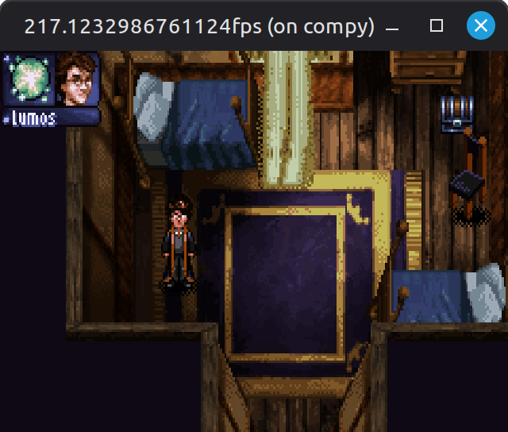
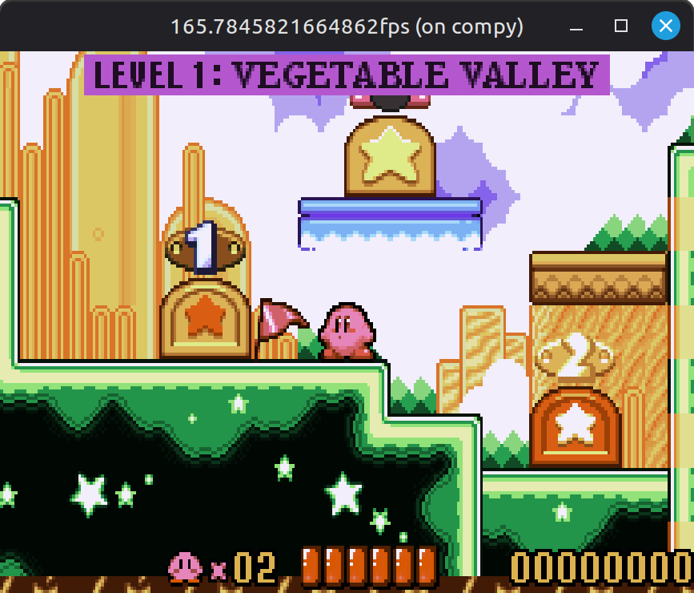
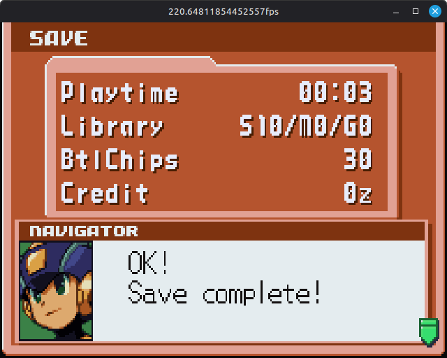
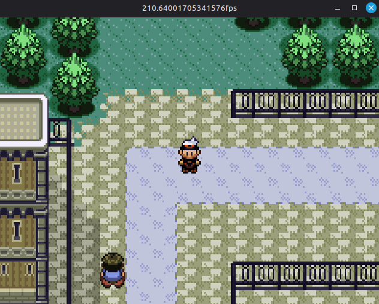

# Bass
A GameBoy Advance emulator. Not the best, not the worst. DMA is currently broken, and EEPROM saves are not implemented yet (neither is alpha blending, special fx & mosaic is not implemented)

## Screenshots

## Acknowledgments/Resources

heavily used GBATEK and TONC (incl. the demos!), wouldn't be possible without these invaluable resources:

### [GBATEK](https://problemkaputt.de/gbatek.htm) by Martin "no$cash" Koth
### [TONC](https://www.coranac.com/tonc/text/toc.htm) by Jasper "cearn" Vijn